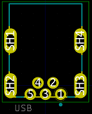
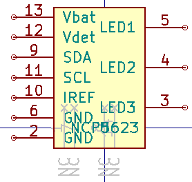

# My KiCAD libraries

This repo contains KiCAD models and footprints I made for various components.
It may or may not grow in the future.

## How to install a footprint
To install them, download this repo (either use the `git clone` command, or use the Github feature to download these files as a zip), preferably in a sufolder of your KiCAD project. \
Then, in KiCAD's footprints editor, go to `File>add library` and import the `*.pretty` you have just downloaded ([more info here](https://forum.kicad.info/t/how-to-get-a-downloaded-symbol-footprint-or-full-library-into-kicad-version-5/19485)).

## How to install a symbol
To install them, download this repo (either use the `git clone` command, or use the Github feature to download these files as a zip), preferably in a sufolder of your KiCAD project. \
Then, in KiCAD's symbol editor, go to `File>add library` and import the `*.lib` file you have just downloaded ([more info here](https://forum.kicad.info/t/how-to-get-a-downloaded-symbol-footprint-or-full-library-into-kicad-version-5/19485)).

# Models in this repo

## Omron relays
This repo contains a footprint for __Omron LY1* and LY2*__ relays.
It has been succefully tested with LY2N-J (also written LY2NJ) relays.
According to [Omron's datasheet](https://www.fa.omron.com.cn/data_pdf/cat/ly_ds_e_4_7_csm54.pdf?id=949), it should also suit the following parts:

* LY1
* LY1N
* LY1-D
* LY1N-D2
* LY2
* LY2Z
* LY2N
* LY2-D
* LY2Z-D
* LY2N-D2
* LY2ZN-D2

This repo only contains the **footprint** of such parts. To add the component to a **schematic**, choose any component that has the same number of terminals. For instance, choose from the built-in `relays` library, or, slightly better, the `LY20` component from the `relay` library from library.oshec.org.

Then, associate these parts to this footprint.

## Omron mini-USB connector
This repo contains a footprint for the __Omron XM7D-0512__ through-hole mini-USB connector. It comes from [https://www.snapeda.com/parts/XM7D-0512/Omron%20Electronics%20Inc-EMC%20Div/view-part/](https://www.snapeda.com/parts/XM7D-0512/Omron%20Electronics%20Inc-EMC%20Div/view-part/), but corrects how the edges are drawn (they were mostly drawn on the wrong layers from this original URL).

This is the footprint only. Any mini-USB connector symbol from the standard KiCad library will do (although the original URL for the footprint also contains a symbol, that should be OK).

# Symbols in this repo

## NCP5623 (I2C RGB LED driver)

This repo contains a symbol of the NCP5623 I2C PWM LED driver. \
This repo does not contain any footprint for it, since it is a regular TSSOP-24 package, which is already in KiCad's default libraries (`Package_SO:TSSOP-14_4.4x5mm_P0.65mm`).

# More to come
(maybe)