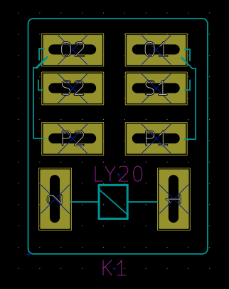

# My KiCAD libraries

This repo contains KiCAD models and footprints I made for various components.
It may or may not grow in the future.

## Omron relays
This repo contains a footprint for __Omron LY1* and LY2*__ relays.
It has been succefully tested with LY2N-J (also written LY2NJ) relays.
According to [Omron's datasheet](https://www.fa.omron.com.cn/data_pdf/cat/ly_ds_e_4_7_csm54.pdf?id=949), it should also suit the following parts:

* LY1
* LY1N
* LY1-D
* LY1N-D2
* LY2
* LY2Z
* LY2N
* LY2-D
* LY2Z-D
* LY2N-D2
* LY2ZN-D2

This repo only contains the **footprint** of such parts. To add the component to a **schematic**, choose any component that has the same number of terminals. For instance, choose from the built-in `relays` library, or, slightly better, the `LY20` component from the `relay` library from library.oshec.org.

Then, associate these parts to this footprint.

## More to come
(maybe)